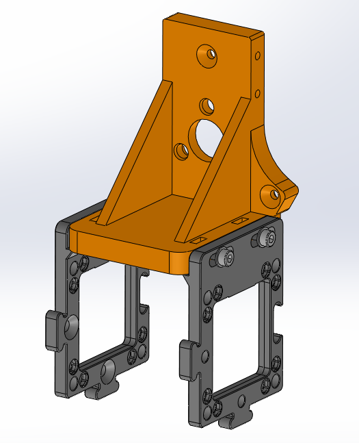

# Jubilee adapter for the UC2

Simple Jubilee tool and adapters for the UC2 optical toolbox.
Two custom puzzle pieces fit the openUC2 and can be attached to the jubilee tool.
This tool was created during the convergence workshop : https://jubilee-csl.github.io/convergence/

## BOM: 

3D printed parts :
 - 1 Jubilee custom tool for UC2
 - 1 right UC2 puzzle adaptor
 - 1 left UC2 puzzle adaptor

Mechanical components :
 - 4 M3x12 screws
 - 4 M3 nuts

Tools :
 - Hex key for M3 screws

## Assembling:

Incoming
