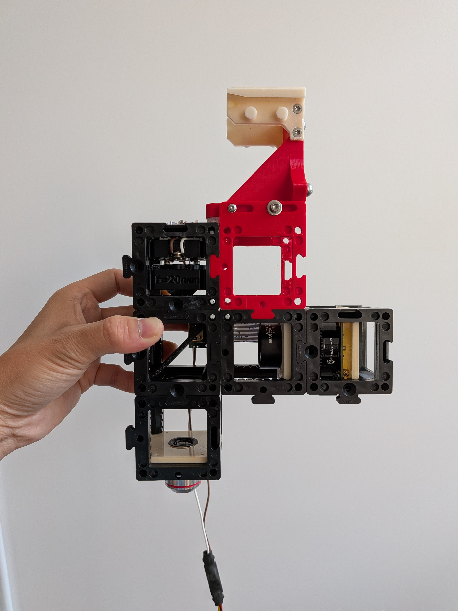
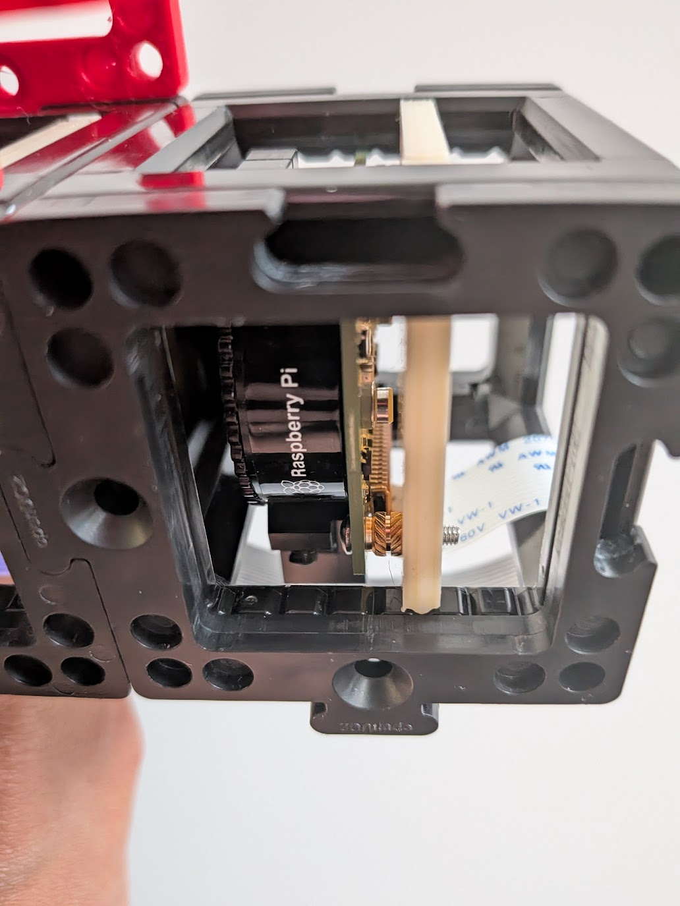
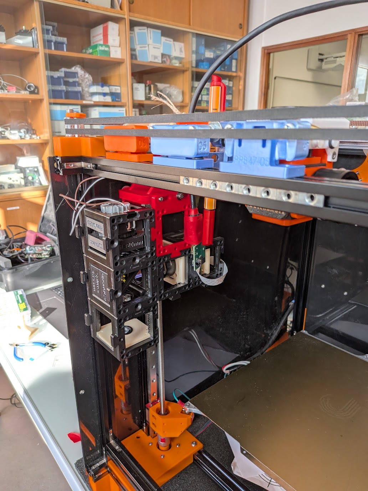
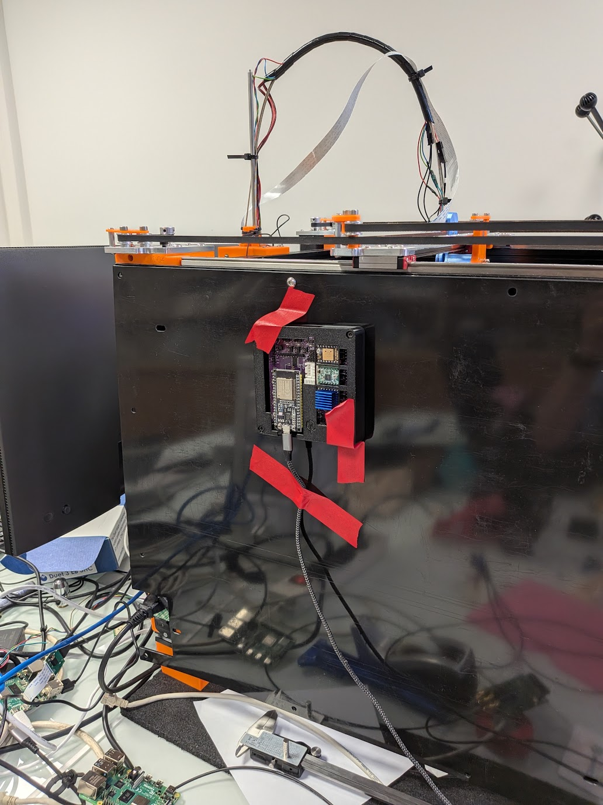

# Jubilee adapter for the UC2

Simple Jubilee tool and adapters for the UC2 optical toolbox.
Two custom puzzle pieces fit the openUC2 and can be attached to the jubilee tool.
This tool was created during the convergence workshop : https://jubilee-csl.github.io/convergence/

## BOM

### Tool adapter parts

3D-printed parts (units: mm, probably):
- 1 Jubilee custom tool plate for UC2 ([Solidworks](./solidworks_files/jubilee_tool_for_UC2.SLDPRT); [STL](./stl_files/jubilee_tool_for_UC2.STL) for 3D printing)
- 1 left-side UC2 puzzle adaptor ([Solidworks](./solidworks_files/left_puzzle_block_for_jubilee.SLDPRT); [STL](./stl_files/left_puzzle_block_for_jubilee.STL) for 3D printing)
- 1 right-side UC2 puzzle adaptor ([Solidworks](./solidworks_files/right_puzzle_block_for_jubilee.SLDPRT); [STL](./solidworks_files/right_puzzle_block_for_jubilee.STL) for 3D printing)

Mechanical components for the adapter:
- 4 M3x12 screws
- 4 M3 nuts
- 4 washers
- Standard Jubilee tool adapter parts

Tools:
- Hex key for M3 screws

# Example: UC2 fluorescence microscope as Jubilee tool

## BOM

### Tool adapter parts

See above.

### UC2 parts

Off-the-shelf UC2 mounting components:
- 5 UC2 cube skeletons/cages ([STEP](./step_files/UC2 Cube Skeleton.step), [buy](https://openuc2.com/core-box/))
- 10 UC2 puzzle pieces ([STEP](./step_files/PRT - 1004 - PUZ11 - V04 - A.stp), [buy](https://openuc2.com/core-box/))

Off-the-shelf optics parts:
- openUC2 Fluo LED Insert with high-power 405 nm (or is it 485 nm?) LED ([buy](https://openuc2.com/fluoresence-led-add-on/))
- openUC2 f=20mm Lens Insert with aspheric lens for collimation ([buy](https://openuc2.com/fluoresence-led-add-on/))
- openUC2 485 nm Splitter with dichroic mirror, excitation filter, and emission filter (PRT 2074, PRT 2075) ([buy](https://openuc2.com/fluoresence-led-add-on/))
- PLAN ∞/- 4X/0.10 objective lens, probably with RMS standard threading ([buy](https://openuc2.com/core-box/))
- AC254-045-A-ML BBAR COATING 400-700nm f = 45.0 mm ↑∞ lens with SM1-threaded mount from Thorlabs ([buy](https://www.thorlabs.com/item/AC254-045-A-ML))
- Raspberry Pi HQ Camera ([buy](https://www.raspberrypi.com/products/raspberry-pi-high-quality-camera/), [STEP](https://grabcad.com/library/raspberry-pi-hq-camera-2))

Off-the-shelf electronics parts:
- openUC2 electronics controller module ([buy](https://openuc2.com/electronics-add-on/))

3D-printed parts (units: mm):
- Notched UC2 insert for RMS-threaded objective lenses ([STL](./stl_files/RMS lens insert notched.stl))
- Notched UC2 insert for SM1-threaded lens mounts ([STL](./stl_files/SM1 lens insert notched.stl))
- Notched UC2 insert for Raspberry Pi HQ Camera ([STL](./stl_files/RPi HQ Camera insert notched.stl))

## Assembly

### Assemble the UC2 device

Mount the optical components on their corresponding inserts, place the inserts into the cubes, and sandwich the cubes between puzzle pieces, in order to match the following photo:

The Raspberry Pi HQ camera insert should be positioned as follows:

### Mount the UC2 device to the Jubilee tool adapter

Snap the puzzle pieces into the appropriate position on the UC2 device, and screw the M3 mounting screws into the tool adapter plate (with the M3 nuts inserted) in order to match the following photo:

Then screw the standard Jubilee tool-holding arms onto the tool adapter plate in order to match the above photo.

Now you can place the tool into a Jubilee tool slot:

### Connect cables & wires

1. Plug the JST connector of the openUC2 Fluo LED module in to the PWM3 port of the openUC2 electronics control module. You should route this cable in a way that makes sense to you, and you may need to first tape the openUC2 electronics control module to the wall of your Jubilee:

   

2. Plug in the USB cable for the openUC2 electronics controller module into your laptop.

3. Connect the Raspberry Pi HQ camera to your Jubilee with your Jubilee's extra-long CSI camera cable. You should route this cable in a way that makes sense to you.

## Operation

Manually controlling the LED for fluorescence illumination:
1. On your laptop, open <https://youseetoo.github.io/flasher> in your web browser; on that web page, open the "Hardware Test" tab.
2. In the "Serial Connection" panel of the web page, click the "Disconnect" button. Select the appropriate USB serial device (it's probably the last one on the list). If the connection succeeds, the Hardware Console should now show the message "Connected to serial port".
3. In the "Laser / Light Source Control" panel, select the "Laser 3" option. Slide the value up to 1023.
4. To turn on the LED, press the "ON" button. This will cause your laptop to send a JSON message to the openUC2 electronics controller module over USB serial. The message should be printed in the Hardware Console: `{"task":"/laser_act","LASERid":3,"LASERval":1000}`. The LED should turn on, and your laptop should receive a reply which it prints in the Hardware Console: `{"qid":0,"success":0}`.
5. To turn off the LED, press the "OFF" button. This will cause your laptop to send a JSON message to the openUC2 electronics controller module over USB serial. The message should be printed in the Hardware Console: `{"task":"/laser_act","LASERid":3,"LASERval":0}`. The LED should turn on, and your laptop should receive a reply which it prints in the Hardware Console: `{"qid":0,"success":0}`.

Picking up and moving the tool: do this the same way you would do it for any standard Jubilee tool.

Capturing images with the camera: do this the same way you would normally do with your Jubilee's embedded camera.

## Development

If you connect the openUC2 electronics control module to the laptop which runs your Jupyter notebooks for controlling the Jubilee, then you can use pyserial to send serial messages to the control module (connected at a baudrate of 115200):
- to turn on the LED at full brightness: `{"task":"/laser_act","LASERid":3,"LASERval":1000}`
- to turn off the LED: {"task":"/laser_act","LASERid":3,"LASERval":0}
Each serial messag should be followed by a newline character (`\n`).

