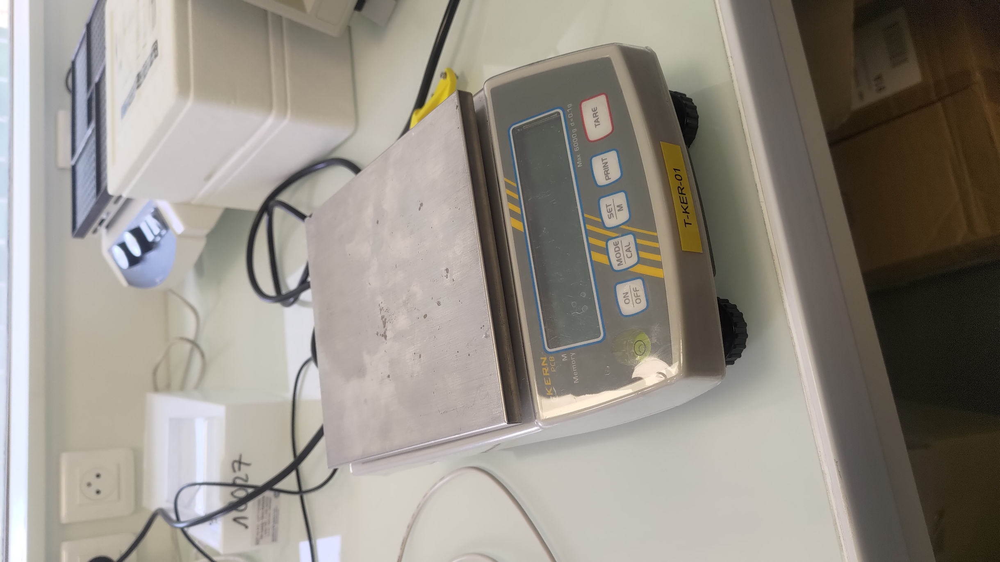
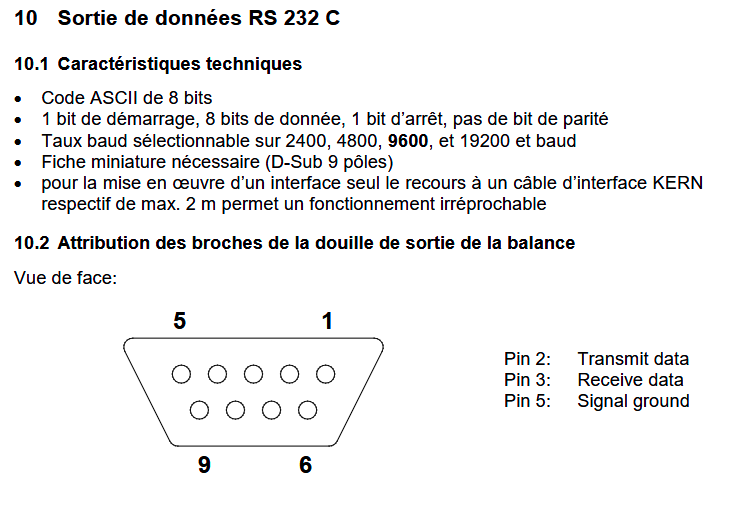
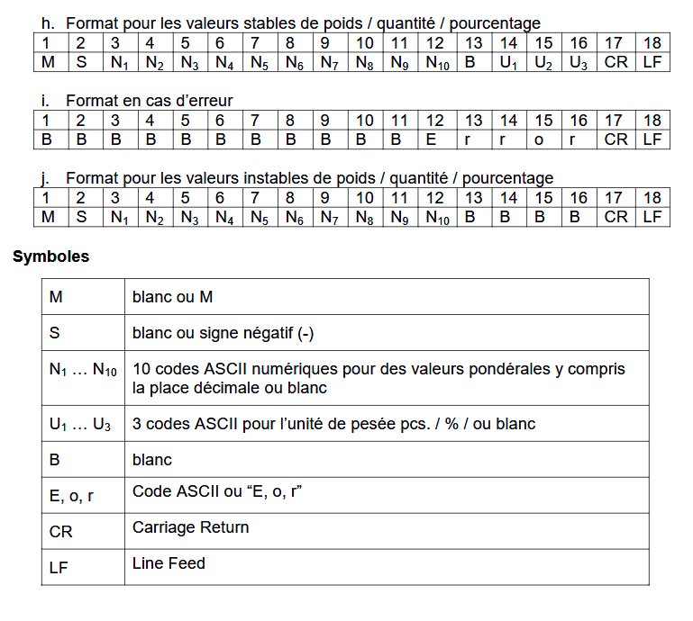

# Balance de précision Kern

Tutoriel pour récupérer les données de mesure d'une balance de précision Kern au moyen du port série.

## Modèle de la balance

Le modèle utilisé est une balance Kern PCB 6000-1

:::warning
Il s'agit d'un ancien modèle de cette référence et la documentation directement disponible sur le site du constructeur n'est pas la bonne.  
Il faut indiquer le numéro de série de la balance pour tomber sur [les bons documents](https://pdb.kern-sohn.com/WebDocs/Product?kto=&token=1da0d230d133dc077ba89f3063f689a58b849480&language=fr&articleNo=TPCB%206K-4-A&serial=&mode=iframe)

:::

[PCB-BA-f-1718.pdf 815377](attachments/dd5b7982-1bf0-4a5e-af9f-87906d221a34.pdf)

## Connexion série

La connexion à l'ordinateur se fait à l'aide d'un adaptateur USB-serial qui respecte le protocole RS-232.  
Voici les infos de configuration série de la doc : 

 

## Configuration de la balance

La connexion série de la balance possède différentes configurations possibles.

Les deux modes les plus pertinents pour l'usage que nous en faisont sont : 

* `AU PC` : Edition des données en continu
  * la balance envoie la valeur mesurée à une certaine fréquence sans être sollicitée
* `rE CR` : Edition de données par ordres de télécommande
  * la balance attend une consigne pour retourner la mesure courante

La configuration du mode se fait au travers du menu `Pr` accessible en maintenant le bouton `PRINT` de la balance.

* En mode pesée maintenir la touche `PRINT` enclenchée jusqu'à ce que soit affiché `[Unit]`.
* Appeler de façon répétée la touche `MODE` jusqu'à ce que `Pr` apparaisse.
* Valider sur la touche `SET` le point de menu appelé, le réglage actuel est affiché.
* Sélectionner sur la touche `MODE` le réglage voulu

D'autres paramètres peuvent être réglés, comme l'unité de mesure et le baudrate de la connexion série.

## Commandes pour la balance en mode télécommande

Lorsque la balance est en mode `rE CR` (Edition de données par ordres de télécommande) elle attend une consigne avant d'envoyer la valeur mesurée.

3 consignes sont disponibles : 

* `s` : La valeur de pesée stable pour le poids est émise par l'interface RS232
* `w` : La valeur de pesée pour le poids (stable ou instable) est émise par l'interface RS232
* `t` : Aucune donnée n'est émise, la balance exécute la fonction de calibrage.

:::warning
Ces commandes doivent être envoyées via l'interface série comme un octet ASCII seul, sans caractère de fin de ligne (CR ou LF)

:::

La réponse reçue a le format suivant : 

 

\