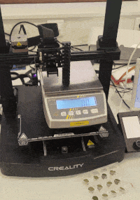
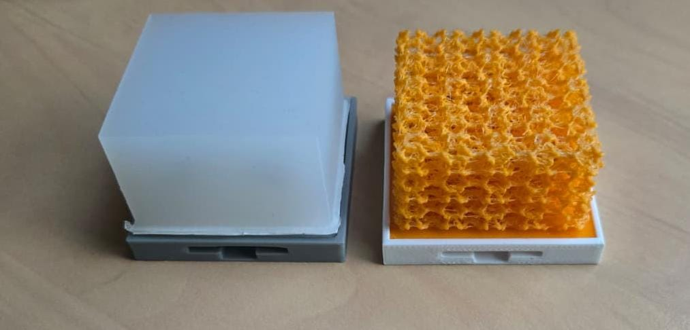

# Enderscope

L'enderscope est une imprimante 3D Creality CR6-SE reconfigurée pour faire des mesures d'effort automatisées.

Elle est constituée de l'imprimante, d'une balance de précision [Kern PCB 6000-1](./balance-de-precision-kern.md) et d'un indenteur qui a remplacé la buse d'impression sur la machine.

Elle permet de définir une zone et une résolution à laquelle faire des mesures d'effort.  
Pour chaque point X,Y de la grille l'indenteur est abaissé jusqu'à atteindre une valeur prédéfinie : 

* d'effort appliqué
* de profondeur en Z

## Base du projet

Le projet est basé sur le [projet open source Enderscopy](https://github.com/mutterer/enderscopy) écrit par Jérôme Mutterer.  
Ce projet permet un interfaçage python facilité avec des imprimantes 3D acceptant du Gcode standard Marlin.

Il contient déjà les fonctionnalités de recherche de l'origine, de préparation de tâches et de définition de trajectoires et de grilles pour des mesures automatisées.

Une première version de l'Enderscope a été développée lors du [workshop convergence](https://jubilee-csl.github.io/convergence/index.html) organisé par Aliénor Lahlou (ENS, Sony CSL) début septembre 2026.

 

## Usage à l'ISIR

La première version de l'Enderscope a été mise au point pour les travaux de recherche sur les e-flesh de Soumia El Montaser et Jenna Fradin.

Les e-flesh sont des corps mous ([impression 3D](https://github.com/notvenky/eFlesh) ou silicone) contenant des aimants à des positions prédéfinies. A l'aide d'un ensemble de capteurs à effet Hall, les variations du champ magnétique peuvent être enregistrées.  
Un modèle peut être entrainé pour faire de l'estimation de force et de position d'un contact sur le e-flesh en se basant sur la variation du champ magnétique.

Pour ce projet le besoin est de parcourir l'ensemble de la surface du e-flesh à un pas de 1mm et en faisant des indentations jusqu'à atteindre un certain effort.  
Pour chaque point, une fois la force souhaitée atteinte, sont enregistrés dans un fichier CSV : 

* la position sur la grille en X, Y
* la profondeur de l'indenteur en Z
* la force appliquée
* les mesures du PCB contenant les capteurs à effet Hall.