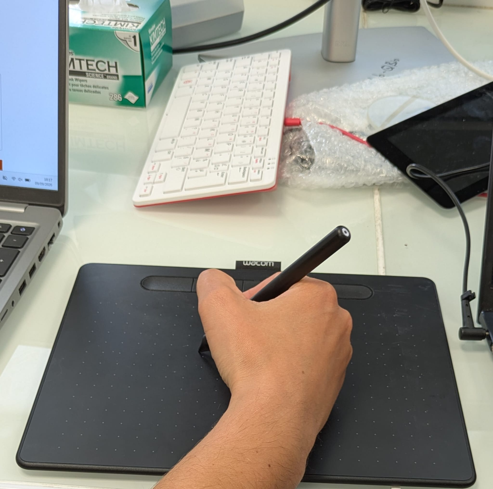

# minimal-wacom-pyglet

**Objective :** To connect to a wacom tablet with pyglet.

**How to use :**
1. Install the wacom driver : https://www.wacom.com/fr-fr/support/product-support/drivers
2. (Optional) Run a pixi shell to have to dependencies: `pixi shell`. Otherwise, install them : `pip install pyglet`.
3. Run the code : `python minimal_wacom_pyglet.py`
